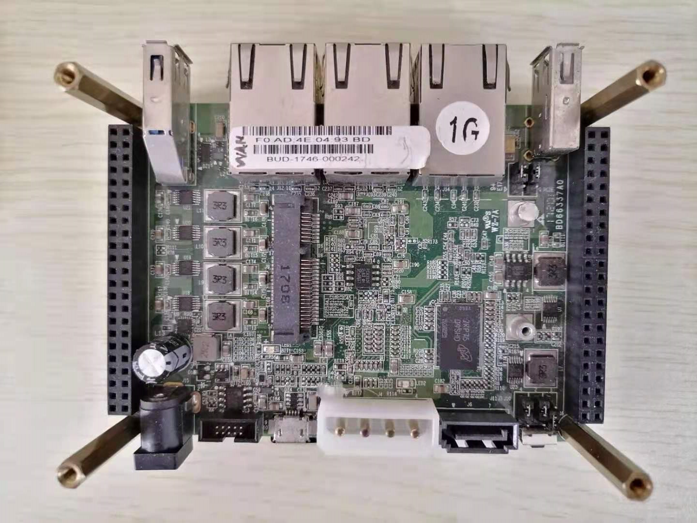

## espressobin v5

SoC: 

- Marvell Armada 3700LP (88F3720) dual-core ARM Cortex A53 processor up to 1GHz

DRAM:

- 1GB DDR3

Network: 

- 88E6341(3XGbE)
- 1x MiniPCIe slot for Wireless/BLE peripherals

Other: 

- 1XSD card
- 4GB eMMC footprint
- SATA power connector and SATA 3.0 connector
- 1XUSB3.0
- 1XUSB2.0
- 1Xmicro USB port
- GPIOs

...





## uboot

Just use the uboot_spiflash.bin shipped in the spi-flash.

boot print:

```
TIM-1.0
WTMI-armada-17.10.1-b90dbf0
ENTER init_ddrgen
DDR_TOPOLOGY is 2 :	DDR3, 2CS 512M + 512M
WTMI_CLOCK=2

Fill memory before self refresh...done

Fill memory before self refresh...done

Now in Self-refresh Mode
Restore CAS Read and Write Latency
Restore termination values to original values
Exited self-refresh ...

DLL TUNING
==============
   DLL 0xc0001050[21:16]: [2,2f,18]
   DLL 0xc0001050[29:24]: [7,34,1d]
   DLL 0xc0001054[21:16]: [1,2b,16]
   DLL 0xc0001054[29:24]: [7,31,1c]
   DLL 0xc0001074[21:16]: [0,3f,1f]
   DLL 0xc0001074NOTICE:  Booting Trusted Firmware
NOTICE:  BL1: v1.3(release):armada-17.10.3:a3306ab
NOTICE:  BL1: Built : 18:22:33, Jan 29 2NOTICE:  BL2: v1.3(release):armada-17.10.3:a3306ab
NOTICE:  BL2: Built : 18:22:35, Jan 29 2018NOTICE:  BL31: v1.3(release):armada-17.10.3:a3306ab
NOTICE:  BL31:

U-Boot 2017.03-armada-17.10.1-gaee49fc (Jan 29 2018 - 18:21:49 +0800)

Model: Marvell Armada 3720 Community Board ESPRESSOBin
       CPU    @ 1000 [MHz]
       L2     @ 800 [MHz]
       TClock @ 200 [MHz]
       DDR    @ 800 [MHz]
DRAM:  1 GiB
U-Boot DT blob at : 000000003f7161b8
Comphy-0: USB3          5 Gbps    
Comphy-1: PEX0          2.5 Gbps  
Comphy-2: SATA0         6 Gbps    
SATA link 0 timeout.
AHCI 0001.0300 32 slots 1 ports 6 Gbps 0x1 impl SATA mode
flags: ncq led only pmp fbss pio slum part sxs 
PCIE-0: Link down
MMC:   sdhci@d0000: 0, sdhci@d8000: 1
SF: Detected w25q32dw with page size 256 Bytes, erase size 4 KiB, total 4 MiB
Net:   eth0: neta@30000 [PRIME]
```


default env:

```
baudrate=115200
bootargs=console=ttyMV0,115200 earlycon=ar3700_uart,0xd0012000 root=/dev/mmcblk0p1 rw rootwait
bootcmd=load mmc 0:1 0x4d00000 boot.scr; source 0x4d00000;run bootmmc;
bootdelay=2
bootmmc=mmc dev 0; ext4load mmc 0:1 $kernel_addr $image_name;ext4load mmc 0:1 $fdt_addr $fdt_name;setenv bootargs $console root=/dev/mmcblk0p1 rw rootwait; booti $kernel_addr - $fdt_addr
console=console=ttyMV0,115200 earlycon=ar3700_uart,0xd0012000
eth1addr=00:51:82:11:22:01
eth2addr=00:51:82:11:22:02
eth3addr=00:51:82:11:22:03
ethact=neta@30000
ethaddr=00:51:82:11:22:00
ethprime=eth0
fdt_addr=0x1000000
fdt_high=0xffffffffffffffff
fdt_name=boot/armada-3720-community.dtb
fdtcontroladdr=3f7161b8
fileaddr=2000000
filesize=1480200
gatewayip=10.4.50.254
get_env=if fatload mmc 0 $loadaddr /uEnv.txt; then env import -t $loadaddr $filesize; if test -n ${uenvcmd}; then run uenvcmd; fi; fi
get_images=fatload mmc 0 $kernel_addr $image_name && fatload mmc 0 $fdt_addr $fdt_name
get_ramdisk=fatload mmc 0 $ramdisk_addr $ramdisk_name
get_ramfs=if test "${ramfs_name}" != "-"; then setenv ramfs_addr 0x8000000; tftpboot $ramfs_addr $ramfs_name; else setenv ramfs_addr -;fi
hostname=marvell
image_name=boot/Image
initrd_addr=0xa00000
initrd_size=0x2000000
ipaddr=0.0.0.0
kernel_addr=0x2000000
loadaddr=0x5000000
netdev=eth0
netmask=255.255.255.0
ramdisk_addr=0x1100000
ramdisk_name=/initramfs-linux.uimg
ramfs_addr=0x8000000
ramfs_name=-
root=root=/dev/nfs rw
rootpath=/srv/nfs/
serverip=0.0.0.0
set_bootargs=setenv bootargs $console $root ip=$ipaddr:$serverip:$gatewayip:$netmask:$hostname:$netdev:none nfsroot=$serverip:$rootpath $extra_params
stderr=serial@12000
stdin=serial@12000
stdout=serial@12000
```


## linux

```
export ARCH=arm64
export CROSS_COMPILE=aarch64-linux-gnu-
```

```
wget https://mirrors.edge.kernel.org/pub/linux/kernel/v4.x/linux-4.14.160.tar.xz
tar -xf linux-4.14.160.tar.xz -C /linux
cd /linux/
```

```
make defconfig
make menuconfig
	CONFIG_ARCH_MVEBU
	CONFIG_NET_DSA
	CONFIG_NET_DSA_MV88E6XXX
	CONFIG_NFSD
# or
cp my_espressobin_v5.config .config
```

```
make [-j]
# you got arch/arm64/boot/Image and arch/arm64/boot/dts/marvell/armada-3720-espressobin.dtb
```


### how to burn linux

Assume /dev/sdb is the TF card, rootfs.tar.bz2 is your rootfs.

1. make two partition in /dev/sdb, they are /dev/sdb1 and /dev/sdb2, the first is in fat16 format, while the other is in ext4 format.

2. mount /dev/sdb1 /mnt1 && mount /dev/sdb2 /mnt2

3. tar -xf rootfs.tar.bz2 -C /mnt2

4. cd /linux && make modules_install INSTALL_MOD_PATH=/mnt2

5. ```
   mkdir /mnt1/boot
   cp /linux/arch/arm64/boot/Image /mnt1/boot
   cp /linux/arch/arm64/boot/dts/marvell/armada-3720-espressobin.dtb /mnt1/boot
   
   cat > boot.txt << 'EOF'
   setenv fdt_name 'boot/armada-3720-espressobin.dtb'
   setenv image_name 'boot/Image'
   setenv bootmmc 'mmc dev 0; fatload mmc 0:1 $kernel_addr $image_name; fatload mmc 0:1 $fdt_addr $fdt_name
   setenv bootargs 'console=ttyMV0,115200 earlycon=ar3700_uart,0xd0012000 root=/dev/mmcblk0p2 rw rootwait'
   booti $kernel_addr - $fdt_addr'
   EOF
   
   mkimage -A arm64 -O linux -T script -C none -a 0 -e 0 -n "Marvell Boot Script" -d boot.txt boot.scr
   
   rm -f boot.txt
   mv boot.scr /mnt1/boot
   ```

6. umount /dev/sdb1 && umount /dev/sdb2


## rootfs

Could be any, you could try another repo of mine:

https://github.com/David-Croose/various_arm_fs


## REFER

https://espressobin.net

